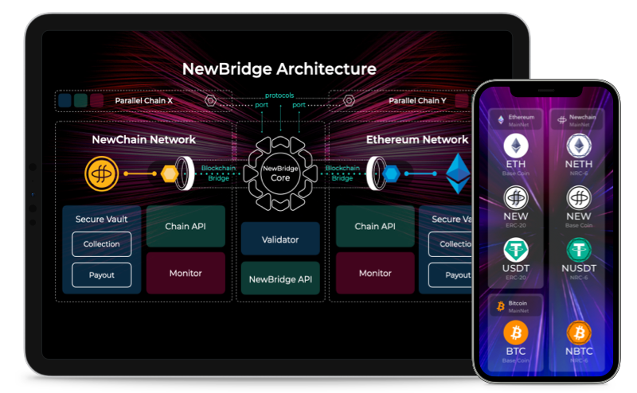

  <h1>NewBridge</h1>
  <h2>Connecting Blockchains</h2>
  
NewBridge connects blockchains together. With NewBridge App everyone can transfer Cross-Chain Assets easily & securely. Developers can create DApps using NewBridge API.

  

      
      

        <a class="btn" href="https://app.newbridge.network">Launch App</a>
      

  



<i class="nf nf-fa-file_text_o"></i>

### Documentation

Learn more about NewBridge

View

<--->

<i class="nf nf-fa-code"></i>

### NewBridge APIs

Create Cross-chain Dapps

View

<--->

<i class="nf nf-fa-question_circle_o"></i>

### FAQs

Where questions get answered

View



---

## GET NEWBRIDGE UPDATES

Follow Newton Project on <a href="https://www.twitter.com/newton_project/" rel="noreferrer" target="_blank">Twitter</a>

Join Newton Project <a href="https://www.twitter.com/newton_project/" rel="noreferrer" target="_blank">Telegram Group</a>

## NEWTON PROJECT

### Infrastructure for the Community Economy

NewBridge is developed by Newton Project Core Team. And open-sourced on <a href="https://github.com/newtonproject/newbridge.network" rel="noreferrer" target="_blank">Github</a>

#### Everyone Should Benefit from Economic Growth

Visit [Newton Project Website](https://www.newtonproject.org)
